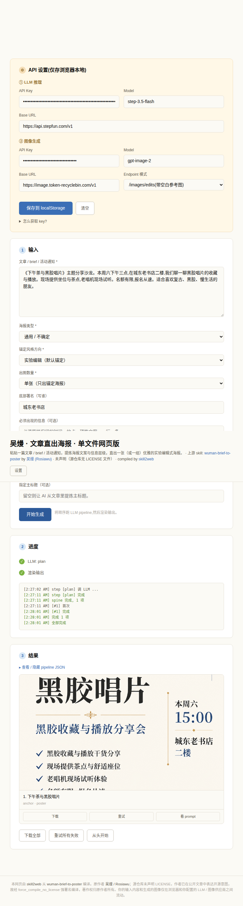

# skill2web

**English** · [中文](README.zh-CN.md)

> Compile any Claude skill into a single-file HTML web tool.

**Core philosophy:** build-time is an agent; run-time is **not**. End users get a lightweight web page with no agent runtime — just open it in a browser.

## What it is

AI practitioners have written a wealth of high-quality Claude Code skills (PPT generators, posters, recipe writers, doc polishers), but **only developers with Claude Code installed can run them**. The non-technical audience — your friends, family, or community members who don't know "what an agent is" — can't experience them. `skill2web` compiles flow-shaped skills (input → N LLM calls → template render → output) into a single-file HTML so anyone can use them by clicking a link.

**Scope:** flow-shaped skills (input → 1–3 LLM calls → template render → output). Since v0.3 the LLM pipeline is a **static DAG** — branch/merge is fine as long as the graph is fully known and finite at compile time. Unbounded loops / runtime-decided control flow (true agent shape) are explicitly refused by the compiler.

## Hero cases (end-to-end verified)

Each case below was compiled from an IR via `skill/compose.py`, run against real LLM / image-gen APIs in a browser, and screenshotted in its final delivered state.

| Hero case | `ir_kind` | Upstream skill | Screenshot |
|---|---|---|---|
| **ian-handdrawn-ppt** | `image-deck` | [helloianneo/ian-handdrawn-ppt](https://github.com/helloianneo/ian-handdrawn-ppt) |  |
| **wuman-brief-to-poster** | `image-deck` | [Rosiawu/wuman-brief-to-poster](https://github.com/Rosiawu/wuman-brief-to-poster) |  |
| **prompt-master** | `template-html` | [nidhinjs/prompt-master](https://github.com/nidhinjs/prompt-master) |  |
| **app-onboarding-blueprint** | `template-html` (downgraded) | [adamlyttleapps/claude-skill-app-onboarding-questionnaire](https://github.com/adamlyttleapps/claude-skill-app-onboarding-questionnaire) |  |
| **synthetic-essay-polisher** | `template-html` | synthetic (no upstream) |  |
| **guizang-cover** | `png-canvas` | shape from [op7418/guizang-ppt-skill](https://github.com/op7418/guizang-ppt-skill) |  |

## Current status (v0.3, 2026-05-18)

- Design docs: [`DESIGN.md`](DESIGN.md) (v0.1) + [`DESIGN-v0.2.md`](DESIGN-v0.2.md) (→ v0.2) + [`DESIGN-v0.3.md`](DESIGN-v0.3.md) (→ v0.3)
- Compiler — three-step assembly (skeleton + block + adapter): `python3 skill/compose.py <ir.json> <out.html>`
- Three supported `ir_kind` values:
  - `image-deck` — multiple related images (e.g. `ian-handdrawn-ppt`, `wuman-brief-to-poster`)
  - `template-html` — markdown / structured report (e.g. `synthetic-essay-polisher`, `prompt-master`)
  - `png-canvas` — single cover / poster (e.g. `guizang-cover`)
- **v0.3 — static-DAG `llm_pipeline`**: a step's `uses` may have multiple parents (merge) and carry a structured `when` branch condition (fork). The graph must be fully known and finite at compile time; the runtime executes it as a state machine with conditional skip. Only unbounded / runtime-shaped control flow is refused.
- **v0.3 — mandatory frontend-design pass**: every compile must consult the `frontend-design` skill before composing; its CSS lands in `IR.theme_overrides`.
- v0.2.1 — the **SOP-vs-tool downgrade path**: agent-shape skills can still be compiled, but the compiler states explicitly what was dropped (see `app-onboarding-blueprint`).
- IR migration: v0.1 → v0.2 via `skill/migrate_v01_to_v02.py`; v0.2 → v0.3 needs none (strict superset).
- Spike-gated (DESIGN §11): `pptx-canvas` / `data-table` exist as schema drafts only; implementation waits for a real triggering skill.

## Project structure

```
skill2web/
├── README.md                          # this file (English)
├── README.zh-CN.md                    # Chinese mirror
├── LICENSE                            # MIT
├── DESIGN.md                          # v0.1 design doc
├── DESIGN-v0.2.md                     # v0.2 evolution doc
├── DESIGN-v0.3.md                     # v0.3 evolution doc (this release)
├── CHANGELOG.md
├── CONTRIBUTING.md
├── TODO.md                            # v0.2.x backlog
├── docs/screenshots/                  # hero-case screenshots used in README
├── hero-cases/                        # hand-authored + auto-recompiled references
├── dist/                              # compiled artifacts + per-artifact README + REFUSAL example
└── skill/                             # v0.2 compiler
    ├── SKILL.md                       # main entry (6 phases + 4 user gates)
    ├── compose.py                     # three-step composer
    ├── migrate_v01_to_v02.py          # v0.1 → v0.2 IR migration
    ├── examples/                      # 5 IR examples (one per hero case)
    ├── references/                    # IR core + ir_kinds + adapters + render-libs
    └── templates/                     # skeleton + blocks + adapters
```

## Running a hero case

`hero-cases/ian-handdrawn-ppt/index.html` is a **single source file** (no external CDN dependency), but at runtime it **must be served over HTTP** — browsers behave inconsistently for `fetch()` / `localStorage` under `file://`, which causes requests to fail or drift.

The exact promise: **"single source file + any HTTP server" = works in any browser**, including:

- `python3 -m http.server` (simplest)
- GitHub Pages / Surge / Cloudflare Pages / Netlify
- Your own nginx / Caddy

Not included: **double-clicking the `.html` file**. That path is unstable; don't promise it to end users.

Quickest local route:

```bash
cd hero-cases/ian-handdrawn-ppt/
python3 -m http.server 8765
# open http://localhost:8765/
```

First visit asks for two API keys (stored only in browser `localStorage`, never sent to any third party):
- An LLM inference key (for content decomposition / slide spine generation)
- An image generation key (for the hand-drawn-style PNGs)

## Compile your own skill

```bash
# 1. Author an IR JSON (see skill/examples/*.ir.json for templates)
# 2. Assemble into a single-file HTML
python3 skill/compose.py path/to/your.ir.json dist/your-skill.html

# 3. Preview locally
cd dist && python3 -m http.server 8765
```

The full pipeline — analyzer-checklist 9-step decision tree, IR field semantics, adapter / render-libs selection — lives in [`skill/SKILL.md`](skill/SKILL.md) and [`skill/references/`](skill/references/).

> ⚠️ **v0.1 known risk (post-codex-review 2026-05-15):** the default providers (DeepSeek, StepFun, `image.token-recyclebin.com`) have **not been verified for browser-side CORS** — they have only been exercised through Python backends so far. The first run may hit a CORS preflight error; if it does, check DevTools → Network for the preflight response or fall back to the OpenAI / Anthropic direct-browser endpoints. PRs adding browser CORS verification entries to `skill/references/render-libs.md` are very welcome.

## Contributing

Issues and PRs welcome. We especially want:

- New hero cases (in particular, real skills that trigger a spike-gated `ir_kind`)
- Browser-CORS verification entries for the default providers
- Edge cases on the IR migration path (v0.1 → v0.2 → future v0.3)

See [CONTRIBUTING.md](CONTRIBUTING.md) for the full workflow.

For anything outside the issue tracker — security reports, license questions, takedown requests — email the maintainer at `niuniu869@qq.com`.

## License

MIT — see [`LICENSE`](LICENSE).
Compiled artifacts preserve the upstream skill's license and attribution (each hero-case directory carries a `source-attribution.md`).
