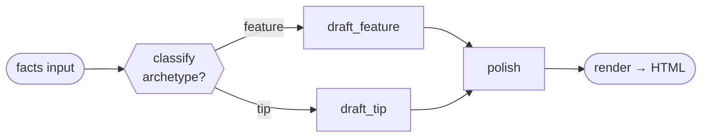
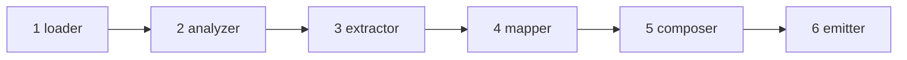

<div align="center">

# 🌐 skill2web

**Compile any Claude skill into a single-file HTML web tool.**

*Build-time is an agent. Run-time is **not**. Your friends just open a link.*

[](LICENSE)
[](CHANGELOG.md)
[](skill/SKILL.md)
[](#-quick-start)
[](#-gallery--hero-cases)

**English** · [中文](README.zh-CN.md)

<table>
  <tr>
    <td></td>
    <td></td>
    <td></td>
  </tr>
</table>

</div>

---

## 🤔 Why skill2web exists

AI practitioners have written a wealth of high-quality Claude Code skills — PPT generators, posters, recipe writers, doc polishers. But there's a wall:

> **Only developers with Claude Code installed can run them.**

Your friends, family, and community members — the people who don't know "what an agent is" — can't experience any of it. `skill2web` compiles **flow-shaped** skills into a **single-file HTML** so anyone can use them by clicking a link. No install, no agent runtime, no terminal.

The whole design rests on one sentence:

> **Build-time is an agent; run-time is not.**
> All `agent`-shaped complexity is resolved at compile time. The end user gets a static, self-contained `.html` — open it in any browser.

---

## ⚡ What it can compile

skill2web targets **flow-shaped** skills: `input → 1–3 LLM calls → template render → output`. Three output kinds are supported today, each end-to-end verified:

| `ir_kind` | What it produces | Example hero case |
|---|---|---|
| 🖼️ `image-deck` | Multiple related images (slide deck, poster set) | `ian-handdrawn-ppt`, `wuman-brief-to-poster` |
| 📄 `template-html` | Markdown / structured report | `prompt-master`, `synthetic-essay-polisher` |
| 🎨 `png-canvas` | A single cover / poster image | `guizang-cover` |

**The compilability boundary** — `skill2web` is honest about what it *cannot* do:

- ✅ **Static DAG** — branch / merge is fine, as long as the control-flow graph is **fully known and finite at compile time** (since v0.3).
- ✅ **SOP-shaped agents** — compiled via an explicit *downgrade path* that states what was dropped.
- ❌ **True agents** — unbounded loops, runtime-decided control flow, "call tools until satisfied". These are **refused loudly** by the compiler, with a friendly explanation, rather than producing a broken page.

---

## 🎬 Gallery — Hero cases

Each case below was compiled from an IR via `skill/compose.py`, run against **real LLM / image-gen APIs in a browser**, and screenshotted in its final delivered state.

<table>
  <tr>
    <td align="center"><b>ian-handdrawn-ppt</b><br><code>image-deck</code></td>
    <td align="center"><b>wuman-brief-to-poster</b><br><code>image-deck</code></td>
    <td align="center"><b>guizang-cover</b><br><code>png-canvas</code></td>
  </tr>
  <tr>
    <td></td>
    <td></td>
    <td></td>
  </tr>
  <tr>
    <td align="center"><b>prompt-master</b><br><code>template-html</code></td>
    <td align="center"><b>synthetic-essay-polisher</b><br><code>template-html</code></td>
    <td align="center"><b>app-onboarding-blueprint</b><br><code>template-html</code> (downgraded)</td>
  </tr>
  <tr>
    <td></td>
    <td></td>
    <td></td>
  </tr>
</table>

| Hero case | Upstream skill |
|---|---|
| `ian-handdrawn-ppt` | [helloianneo/ian-handdrawn-ppt](https://github.com/helloianneo/ian-handdrawn-ppt) |
| `wuman-brief-to-poster` | [Rosiawu/wuman-brief-to-poster](https://github.com/Rosiawu/wuman-brief-to-poster) |
| `prompt-master` | [nidhinjs/prompt-master](https://github.com/nidhinjs/prompt-master) |
| `app-onboarding-blueprint` | [adamlyttleapps/claude-skill-app-onboarding-questionnaire](https://github.com/adamlyttleapps/claude-skill-app-onboarding-questionnaire) |
| `synthetic-essay-polisher` | synthetic (no upstream) |
| `guizang-cover` | shape from [op7418/guizang-ppt-skill](https://github.com/op7418/guizang-ppt-skill) |

---

## 🧬 v0.3 spotlight — static-DAG compilation

v0.2 rejected **all** branch/merge skills as "agent-shaped". That was an honest mistake: a *static, finite* branch graph is a deterministic workflow, not an agent — the browser just evaluates pure conditions and follows fixed edges. **v0.3 redraws the line at the honest place.**

`teams-channel-post-writer` (compiled from [daymade/claude-code-skills](https://github.com/daymade/claude-code-skills/tree/main/teams-channel-post-writer), built into [`dist/`](dist/)) is a static-DAG **demonstration artifact** — it validates the v0.3 fork/merge runtime end-to-end, but is not yet promoted to a formal hero case. It takes a topic + verified facts, then **classifies the post archetype** and drafts down the matching branch:



- `classify` runs **one** LLM call and outputs `{ archetype }`.
- `draft_feature` / `draft_tip` carry a structured `when` condition — **only the matching branch runs**; the other is greyed out (`skip`) on the progress bar.
- `polish` is a **merge** node — a step is skipped only when *all* its parents were skipped, so a merge still runs as long as one branch produced output.

One run = `classify → draft_X → polish` = 3 LLM calls. Same compiled file, two paths:

<table>
  <tr>
    <td align="center"><b>archetype = feature</b><br><sub>→ draft_feature branch</sub></td>
    <td align="center"><b>archetype = tip</b><br><sub>→ draft_tip branch</sub></td>
  </tr>
  <tr>
    <td></td>
    <td></td>
  </tr>
</table>

**The honest boundary:** compilability depends on *"is the control-flow graph fully known and finite at compile time?"* — **not** on *"does the flow contain a decision?"*. Unbounded loops and runtime-shaped graphs stay refused.

v0.3 also adds a **mandatory `frontend-design` pass** — every compile must consult the `frontend-design` skill before composing; its CSS lands in `IR.theme_overrides` and is inlined last.

---

## 🚀 Quick start

### Run a hero case (as an end user)

> A compiled `.html` is a **single source file** with no external CDN dependency — but it **must be served over HTTP**. Browsers behave inconsistently for `fetch()` / `localStorage` under `file://`. **Double-clicking the file is not supported.**

```bash
cd hero-cases/ian-handdrawn-ppt/
python3 -m http.server 8765
# open http://localhost:8765/
```

The exact promise: **"single source file + any HTTP server" = works in any browser** — `python3 -m http.server`, GitHub Pages, Surge, Cloudflare Pages, Netlify, or your own nginx / Caddy.

First visit asks for two API keys (stored **only** in browser `localStorage`, never sent to any third party):
- An **LLM inference** key — for content decomposition / spine generation
- An **image generation** key — for image-deck / png-canvas kinds

### Compile your own skill (as a skill author)

```bash
# 1. Author an IR JSON  (see skill/examples/*.ir.json for templates)
# 2. Assemble into a single-file HTML
python3 skill/compose.py path/to/your.ir.json dist/your-skill.html

# 3. Preview locally
cd dist && python3 -m http.server 8765
```

The full pipeline — the analyzer-checklist decision tree, IR field semantics, adapter / render-libs selection — lives in [`skill/SKILL.md`](skill/SKILL.md) and [`skill/references/`](skill/references/).

---

## 📐 Best practices baked into the compiler

skill2web is opinionated. These rules are what keep compiled artifacts trustworthy:

1. **Build-time is an agent; run-time is not.** Every bit of `agent`-shaped complexity is resolved at compile time. The artifact ships zero agent runtime.
2. **Refuse loudly, never ship broken.** If a skill can't be reduced to `input → N LLM calls → render → output`, the compiler refuses with a friendly explanation (see [`dist/nature-skills.REFUSAL.md`](dist/) for an example) instead of producing a half-working page.
3. **Draw boundaries at the honest place.** Compilability tracks *compile-time knowability*, not surface shape — a static DAG is in, an unbounded loop is out.
4. **Four human gates.** The compile workflow pauses for explicit user confirmation at 4 points (compilability, IR, adapters, license) — most hand-compile failures were avoidable confusions a human would have caught.
5. **Mandatory `frontend-design` pass.** No artifact is composed without first consulting the `frontend-design` skill; design freedom is scoped to a CSS overlay (`theme_overrides`) so the skeleton's correctness stays intact.
6. **Single file, no CDN, no build step.** Output is one `.html` — no bundler, no `node_modules`, no runtime CDN dependency.
7. **Preserve upstream license & attribution.** Every compiled artifact carries the upstream skill's license and a `source-attribution.md`.

---

## 🛠️ How it works — the 6-phase pipeline



| Phase | Does | Nature |
|---|---|---|
| **1 · loader** | clone / read the source skill | mechanical |
| **2 · analyzer** | decide: compilable, downgrade, or refuse? | LLM judgment + **GATE 1** |
| **3 · extractor** | pull the IR (intermediate representation) | LLM + **GATE 2** |
| **4 · mapper** | map python libs → browser libs | lookup + **GATE 3** |
| **5 · composer** | `frontend-design` pass, then compose HTML | design + assembly |
| **6 · emitter** | write `dist/<name>.html` + README | mechanical + **GATE 4** |

The composer does a **three-step assembly**: `skeleton + block + adapter`. v0.3 is a strict superset of v0.2 — a valid v0.2 IR is a valid v0.3 IR, no migration script needed.

---

## 📁 Project structure

```
skill2web/
├── README.md / README.zh-CN.md     # this file + Chinese mirror
├── DESIGN.md · DESIGN-v0.2.md · DESIGN-v0.3.md   # design evolution
├── CHANGELOG.md · CONTRIBUTING.md · TODO.md
├── docs/screenshots/               # hero-case screenshots
├── hero-cases/                     # hand-authored + recompiled references
├── dist/                           # compiled artifacts + per-artifact README + REFUSAL example
└── skill/                          # the compiler
    ├── SKILL.md                    # main entry (6 phases + 4 user gates)
    ├── compose.py                  # three-step composer
    ├── migrate_v01_to_v02.py       # v0.1 → v0.2 IR migration
    ├── examples/                   # IR examples (one per hero case)
    ├── references/                 # IR core + ir-kinds + adapters + render-libs
    └── templates/                  # skeleton + blocks + adapters
```

> ⚠️ **Known v0.1 risk (post-codex-review 2026-05-15):** the default providers (DeepSeek, StepFun, `image.token-recyclebin.com`) have **not been verified for browser-side CORS** — only exercised through Python backends. The first run may hit a CORS preflight error; if it does, check DevTools → Network for the preflight response, or fall back to the OpenAI / Anthropic direct-browser endpoints. PRs adding verification entries to `skill/references/render-libs.md` are very welcome.

---

## 🤝 Contributing

Issues and PRs welcome. We especially want:

- **New hero cases** — in particular, real skills that trigger a spike-gated `ir_kind` (`pptx-canvas`, `data-table`)
- **Browser-CORS verification entries** for the default providers
- **Edge cases on the IR migration path** (v0.1 → v0.2 → v0.3)

See [CONTRIBUTING.md](CONTRIBUTING.md) for the full workflow. For anything outside the issue tracker — security reports, license questions, takedown requests — email the maintainer at `niuniu869@qq.com`.

## 📄 License

MIT — see [`LICENSE`](LICENSE). Compiled artifacts preserve the upstream skill's license and attribution (each hero-case directory carries a `source-attribution.md`).
