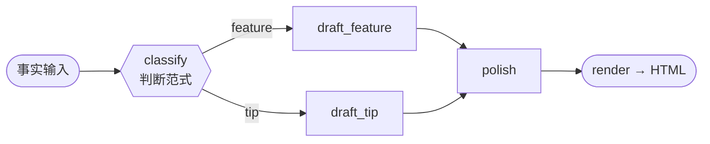
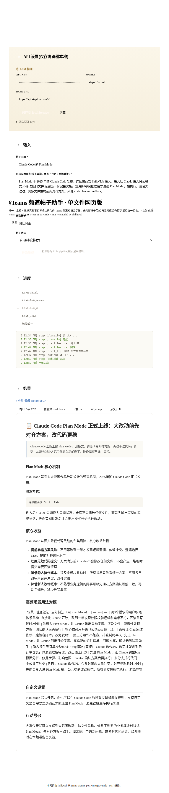
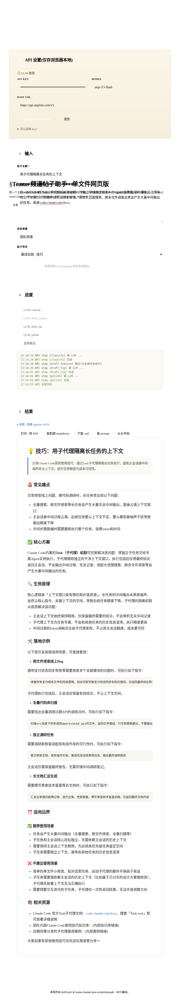
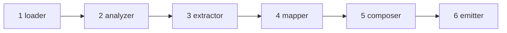

<div align="center">

# 🌐 skill2web

**把任意 Claude skill 编译成单文件 HTML 工具网站。**

*Build-time 是 agent，run-time **不是**。普通用户点个链接就能用。*

[](LICENSE)
[](CHANGELOG.md)
[](skill/SKILL.md)
[](#-快速开始)
[](#-画廊--hero-cases)

[English](README.md) · **中文**

<table>
  <tr>
    <td></td>
    <td></td>
    <td></td>
  </tr>
</table>

</div>

---

## 🤔 为什么有 skill2web

AI 从业者写了大量高质量的 Claude Code skill —— PPT、海报、菜谱、文档润色。但有一堵墙：

> **只有装了 Claude Code 的开发者才能用。**

普通人 —— 不懂"什么是 agent"的朋友、亲戚、协会成员 —— 完全没法体验。`skill2web` 把**流程化** skill 编译成一个**单文件 HTML**，让任何人点开链接即用。不用安装、没有 agent runtime、不碰终端。

整个设计就靠一句话：

> **Build-time 是 agent，run-time 不是。**
> 所有 `agent` 形态的复杂度都在编译期解决掉。最终用户拿到的是一个静态、自包含的 `.html` —— 任何浏览器打开即用。

---

## ⚡ 它能编译什么

skill2web 针对**流程化** skill：`输入 → 1-3 次 LLM 调用 → 模板渲染 → 输出`。目前支持三种产物形态，每种都端到端实测过：

| `ir_kind` | 产出什么 | 示例 hero case |
|---|---|---|
| 🖼️ `image-deck` | 多张相关图（幻灯片组、海报组） | `ian-handdrawn-ppt`、`wuman-brief-to-poster` |
| 📄 `template-html` | markdown / 结构化报告 | `prompt-master`、`synthetic-essay-polisher` |
| 🎨 `png-canvas` | 单张封面 / 海报 | `guizang-cover` |

**可编译性边界** —— `skill2web` 对自己**不能**做什么保持诚实：

- ✅ **静态 DAG** —— 分叉 / 合流都行，只要控制流图在**编译期完全已知且有限**（v0.3 起）。
- ✅ **SOP 形态的 agent** —— 走显式的*降级路径*编译，并明确告诉你降级掉了什么。
- ❌ **真 agent** —— 无界循环、运行时才决定的控制流、"调工具直到满意"。这些会被 compiler **主动、明确地拒绝**，并给出友好解释，而不是产出一个半残的网页。

---

## 🎬 画廊 — Hero cases

下面每个 case 都用 `skill/compose.py` 从 IR 编出来，在**浏览器里跑过真实 LLM / 图像生成 API**，截图为最终产物的展示态。

<table>
  <tr>
    <td align="center"><b>ian-handdrawn-ppt</b><br><code>image-deck</code></td>
    <td align="center"><b>wuman-brief-to-poster</b><br><code>image-deck</code></td>
    <td align="center"><b>guizang-cover</b><br><code>png-canvas</code></td>
  </tr>
  <tr>
    <td></td>
    <td></td>
    <td></td>
  </tr>
  <tr>
    <td align="center"><b>prompt-master</b><br><code>template-html</code></td>
    <td align="center"><b>synthetic-essay-polisher</b><br><code>template-html</code></td>
    <td align="center"><b>app-onboarding-blueprint</b><br><code>template-html</code>（降级）</td>
  </tr>
  <tr>
    <td></td>
    <td></td>
    <td></td>
  </tr>
</table>

| Hero case | 上游 skill |
|---|---|
| `ian-handdrawn-ppt` | [helloianneo/ian-handdrawn-ppt](https://github.com/helloianneo/ian-handdrawn-ppt) |
| `wuman-brief-to-poster` | [Rosiawu/wuman-brief-to-poster](https://github.com/Rosiawu/wuman-brief-to-poster) |
| `prompt-master` | [nidhinjs/prompt-master](https://github.com/nidhinjs/prompt-master) |
| `app-onboarding-blueprint` | [adamlyttleapps/claude-skill-app-onboarding-questionnaire](https://github.com/adamlyttleapps/claude-skill-app-onboarding-questionnaire) |
| `synthetic-essay-polisher` | 合成 hero case（无上游） |
| `guizang-cover` | 形态参照 [op7418/guizang-ppt-skill](https://github.com/op7418/guizang-ppt-skill) |

---

## 🧬 v0.3 重点 — 静态 DAG 编译

v0.2 把**所有**分叉 / 合流 skill 一刀切判为"agent 形态"拒掉。这是个诚实的错误：一个*静态、有限*的分支图是确定性 workflow，不是 agent —— 浏览器只是求值纯条件、走固定的边。**v0.3 把这条线重新画在诚实的位置。**

`teams-channel-post-writer`（编译自 [daymade/claude-code-skills](https://github.com/daymade/claude-code-skills/tree/main/teams-channel-post-writer)，产物在 [`dist/`](dist/)）是一个静态 DAG 的**演示产物** —— 它端到端验证了 v0.3 的分叉/合流 runtime，但尚未提升为正式 hero case。它接收一个主题 + 你已核实的事实，先**判断帖子范式**，再走对应分支起草：



- `classify` 跑**一次** LLM 调用，输出 `{ archetype }`。
- `draft_feature` / `draft_tip` 带结构化 `when` 条件 —— **同一次运行只跑命中的那条**，另一条在进度条上标灰（`skip`）。
- `polish` 是**合流（merge）**节点 —— 一个 step 只在它的父**全部**被 skip 时才 skip，所以只要有一支跑出了输出，merge 就照常执行。

单次执行 = `classify → draft_X → polish` = 3 次 LLM 调用。同一个编译产物，两条路径：

<table>
  <tr>
    <td align="center"><b>archetype = feature</b><br><sub>→ 走 draft_feature 分支</sub></td>
    <td align="center"><b>archetype = tip</b><br><sub>→ 走 draft_tip 分支</sub></td>
  </tr>
  <tr>
    <td></td>
    <td></td>
  </tr>
</table>

**诚实的边界**：可编译性取决于*"控制流图在编译期是否完全已知且有限"* —— **不**取决于*"流程里有没有判断"*。无界循环、运行时才决定形状的图，仍然被拒。

v0.3 还加了一个**强制 `frontend-design` pass** —— 每次编译在组装前必须调 `frontend-design` skill，产出的 CSS 收进 `IR.theme_overrides`，inline 在最后。

---

## 🚀 快速开始

### 跑一个 hero case（最终用户视角）

> 编译产物 `.html` 是**单文件源码**，无外部 CDN 依赖 —— 但**必须通过 HTTP 协议打开**。浏览器对 `file://` 下的 `fetch()` / `localStorage` 行为不一致。**不支持双击 `.html` 文件。**

```bash
cd hero-cases/ian-handdrawn-ppt/
python3 -m http.server 8765
# 访问 http://localhost:8765/
```

精确的承诺：**"单文件源码 + 任何 HTTP server" = 任何浏览器都能开** —— `python3 -m http.server`、GitHub Pages、Surge、Cloudflare Pages、Netlify，或你自己的 nginx / Caddy。

首次打开会要求填两个 API key（**仅**存浏览器 `localStorage`，永不上传任何第三方）：
- **LLM 推理** key —— 用于内容拆解 / spine 生成
- **图像生成** key —— 用于 image-deck / png-canvas 形态

### 编译你自己的 skill（skill 作者视角）

```bash
# 1. 写一个 IR JSON（参考 skill/examples/*.ir.json）
# 2. 组装为单文件 HTML
python3 skill/compose.py path/to/your.ir.json dist/your-skill.html

# 3. 本地预览
cd dist && python3 -m http.server 8765
```

完整流程 —— analyzer-checklist 判定树、IR 字段语义、adapter / render-libs 选型 —— 参见 [`skill/SKILL.md`](skill/SKILL.md) 与 [`skill/references/`](skill/references/)。

---

## 📐 编译器内置的几条最佳实践

skill2web 是有主见的。下面这些规则是编译产物可信赖的根本：

1. **Build-time 是 agent，run-time 不是。** 所有 `agent` 形态的复杂度都在编译期解决，产物里零 agent runtime。
2. **要拒就大声拒，绝不交付半残品。** 若一个 skill 无法归约为 `输入 → N 次 LLM 调用 → 渲染 → 输出`，compiler 会带友好解释明确拒绝（示例见 [`dist/nature-skills.REFUSAL.md`](dist/)），而不是产出一个半能用的网页。
3. **把边界画在诚实的位置。** 可编译性看的是*编译期可知性*，不是表面形态 —— 静态 DAG 在内，无界循环在外。
4. **四道人工 gate。** 编译流程在 4 个点暂停等用户明确确认（可编译性、IR、adapter、license）—— 手工编译失败的大多是用户一句话就能拦下的混淆。
5. **强制 `frontend-design` pass。** 任何产物在组装前都必须先调 `frontend-design` skill；设计自由度被限制在一层 CSS 覆盖（`theme_overrides`），保证 skeleton 的正确性不被改写。
6. **单文件、无 CDN、无构建步骤。** 产物就一个 `.html` —— 没有 bundler、没有 `node_modules`、没有运行时 CDN 依赖。
7. **保留上游 license 与署名。** 每个编译产物都带上游 skill 的 license 和一份 `source-attribution.md`。

---

## 🛠️ 工作原理 — 六阶段流水线



| 阶段 | 做什么 | 性质 |
|---|---|---|
| **1 · loader** | clone / 读取源 skill | 机械 |
| **2 · analyzer** | 判定：可编译、降级、还是拒绝？ | LLM 判断 + **GATE 1** |
| **3 · extractor** | 抽取 IR（中间表示） | LLM + **GATE 2** |
| **4 · mapper** | python 库 → 浏览器库 映射 | 查表 + **GATE 3** |
| **5 · composer** | `frontend-design` pass，再组装 HTML | 设计 + 组装 |
| **6 · emitter** | 写出 `dist/<name>.html` + README | 机械 + **GATE 4** |

composer 做**三步组装**：`skeleton + block + adapter`。v0.3 是 v0.2 的严格超集 —— 一份合法的 v0.2 IR 就是合法的 v0.3 IR，无需迁移脚本。

---

## 📁 项目结构

```
skill2web/
├── README.md / README.zh-CN.md     # 英文 + 中文镜像（本文档）
├── DESIGN.md · DESIGN-v0.2.md · DESIGN-v0.3.md   # 设计演化文档
├── CHANGELOG.md · CONTRIBUTING.md · TODO.md
├── docs/screenshots/               # hero case 截图
├── hero-cases/                     # 手工 / 自动重编的参考 case
├── dist/                           # 编译产物 + 各产物 README + REFUSAL 示例
└── skill/                          # 编译器
    ├── SKILL.md                    # 主入口（六阶段 + 四 user gate）
    ├── compose.py                  # 三步组装 composer
    ├── migrate_v01_to_v02.py       # v0.1 → v0.2 IR 迁移
    ├── examples/                   # IR 示例（hero case 对应）
    ├── references/                 # IR core + ir-kinds + adapters + render-libs
    └── templates/                  # skeleton + blocks + adapters
```

> ⚠️ **v0.1 已知风险（post-codex-review 2026-05-15）**：默认 provider（DeepSeek、StepFun、`image.token-recyclebin.com`）的**浏览器端 CORS 未实测** —— 目前仅作为 Python 后端调用验证过。第一次跑可能撞 CORS preflight 错；若遇到，请在浏览器 DevTools → Network 看 preflight 响应，或换 OpenAI / Anthropic direct-browser 端点。欢迎以 PR 形式把实测结果回灌 `skill/references/render-libs.md`。

---

## 🤝 贡献

欢迎提 issue / PR。重点欢迎的方向：

- **新增 hero case** —— 特别是触发 spike-gated `ir_kind`（`pptx-canvas`、`data-table`）的真实 skill
- **默认 provider 的浏览器 CORS 实测**回灌
- **IR 迁移路径**（v0.1 → v0.2 → v0.3）的边界用例

详见 [CONTRIBUTING.md](CONTRIBUTING.md)。issue tracker 之外的事项（安全反馈、license 问题、下架请求）请邮件联系 `niuniu869@qq.com`。

## 📄 License

MIT —— 详见 [`LICENSE`](LICENSE)。编译产物保留上游 skill 的 license 与作者署名（详见各 hero case 目录下的 `source-attribution.md`）。
