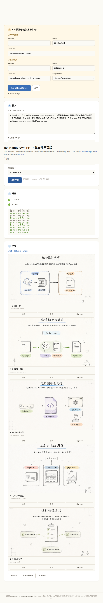
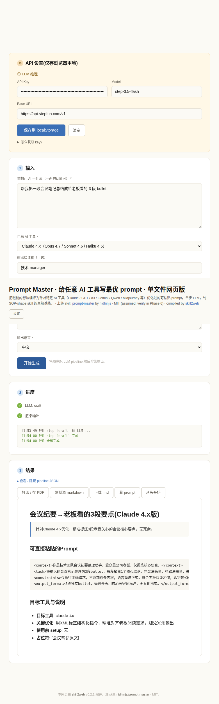
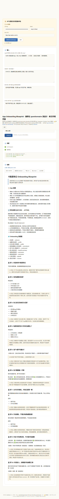
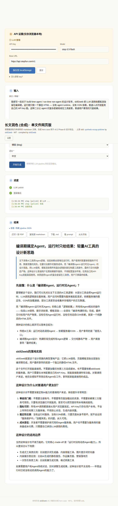
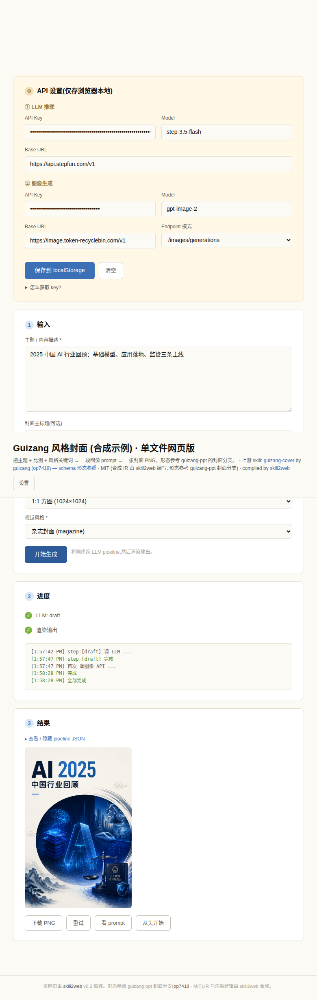

# skill2web

[English](README.md) · **中文**

把任意 Claude skill 编译成单文件 HTML 工具网站。

**核心哲学**：build-time 是 agent，run-time **不是** agent。让普通用户拿到的是一个无 agent runtime 的轻量网页。

## 这是什么

AI 从业者写了大量高质量 Claude Code skill（PPT、海报、菜谱、文档生成），但**只有装了 Claude Code 的开发者才能用**。普通人——不懂"什么是 agent"的朋友、亲戚、协会成员——无法体验。`skill2web` 把流程化 skill（输入 → N 次 LLM 调用 → 模板渲染 → 输出）编译为一个单文件 HTML，让任何人点开即用。

适用范围：流程化 skill（输入 → 1-3 次 LLM 调用 → 模板渲染 → 输出）。多轮 agent 分支 / 不可拆 skill 由 compiler 主动拒绝。

## Hero cases（真实端到端实测）

下面五个 case 都用 `skill/compose.py` 从 IR 编出来，浏览器里跑过真实 API 调用，截图为最终产物的展示态。

| Hero case | `ir_kind` | 上游 skill | 截图 |
|---|---|---|---|
| **ian-handdrawn-ppt** | `image-deck` | [helloianneo/ian-handdrawn-ppt](https://github.com/helloianneo/ian-handdrawn-ppt) |  |
| **prompt-master** | `template-html` | [nidhinjs/prompt-master](https://github.com/nidhinjs/prompt-master) |  |
| **app-onboarding-blueprint** | `template-html`（降级） | [adamlyttleapps/claude-skill-app-onboarding-questionnaire](https://github.com/adamlyttleapps/claude-skill-app-onboarding-questionnaire) |  |
| **synthetic-essay-polisher** | `template-html` | 合成 hero case（无上游） |  |
| **guizang-cover** | `png-canvas` | 形态参照 [op7418/guizang-ppt-skill](https://github.com/op7418/guizang-ppt-skill) |  |

## 当前状态 (v0.2.1, 2026-05-15)

- 设计文档: `DESIGN.md` (v0.1) + `DESIGN-v0.2.md` (v0.1 → v0.2 演化)
- v0.2 编译器: 三步组装 (skeleton + block + adapter) — `python3 skill/compose.py <ir.json> <out.html>`
- 支持三个 `ir_kind`:
  - `image-deck` — 多张相关图 (例 `ian-handdrawn-ppt`)
  - `template-html` — markdown / 报告输出 (例 `synthetic-essay-polisher`, `prompt-master`)
  - `png-canvas` — 单张封面 / 海报 (例 `guizang-cover`)
- v0.2.1 增加 "SOP-vs-tool 降级路径"：agent-shape skill 也能编译，但 compiler 会显式告诉你降级了什么（例 `app-onboarding-blueprint`）
- v0.1 IR → v0.2 自动迁移: `python3 skill/migrate_v01_to_v02.py <v0.1.json> <v0.2.json>`
- spike-gated (DESIGN §11): `pptx-canvas` / `data-table` 仅 schema 草案,等真实 skill 触发实装

## 项目结构

```
skill2web/
├── README.md                          # English
├── README.zh-CN.md                    # 中文（本文档）
├── LICENSE                            # MIT
├── DESIGN.md                          # v0.1 设计文档
├── DESIGN-v0.2.md                     # v0.2 演化文档（本 release 实施依据）
├── CHANGELOG.md
├── CONTRIBUTING.md
├── TODO.md                            # v0.2.x backlog
├── docs/screenshots/                  # README 用 hero case 截图
├── hero-cases/                        # 手工 / 自动重编的参考 case
├── dist/                              # 编译产物 + 各产物 README + REFUSAL 示例
└── skill/                             # v0.2 compiler
    ├── SKILL.md                       # 主入口（六阶段 + 四 user gate）
    ├── compose.py                     # 三步组装 composer
    ├── migrate_v01_to_v02.py          # v0.1 → v0.2 IR 迁移
    ├── examples/                      # 5 个 IR 示例（hero case 对应）
    ├── references/                    # IR core + ir_kinds + adapters + render-libs
    └── templates/                     # skeleton + blocks + adapters
```

## 运行 hero case

`hero-cases/ian-handdrawn-ppt/index.html` 是**单文件源码**（无外部 CDN 依赖），但运行时**必须通过 HTTP 协议提供**——浏览器对 `file://` 协议的 `fetch()` / `localStorage` 行为不一致，会导致请求失败或行为漂移。

承诺的精确版本：**"单文件源码 + 任何 HTTP server" = 任何浏览器开**，包括：

- `python3 -m http.server`（最简单）
- GitHub Pages / Surge / Cloudflare Pages / Netlify
- 你自己的 nginx / Caddy

不包括："双击 `.html` 文件就用"——这种用法**不稳**，不要承诺给最终用户。

最简单的方法：

```bash
cd hero-cases/ian-handdrawn-ppt/
python3 -m http.server 8765
# 访问 http://localhost:8765/
```

首次打开会要求填两个 API key（仅存浏览器 localStorage，永不上传任何第三方）：
- LLM 推理 key（用于内容拆解 / slide spine 生成）
- 图像生成 key（用于生成手绘风 PNG）

## 编译你自己的 skill

```bash
# 1. 写一个 IR JSON（参考 skill/examples/*.ir.json）
# 2. 组装为单文件 HTML
python3 skill/compose.py path/to/your.ir.json dist/your-skill.html

# 3. 本地预览
cd dist && python3 -m http.server 8765
```

完整流程（包括 analyzer-checklist 9 步判定、IR 字段语义、adapter / render-libs 选型）参见 `skill/SKILL.md` 与 `skill/references/`。

> ⚠️ **v0.1 已知风险（post-codex-review 2026-05-15）**：默认 provider（DeepSeek、StepFun、`image.token-recyclebin.com`）的浏览器端 CORS **未实测**——它们目前仅作为 Python 后端调用验证过。第一次跑撞 CORS 错的概率非真零；若遇到，请在浏览器 DevTools Network 看 preflight 响应、或换 OpenAI 官方 / Anthropic direct-browser 端点重试。欢迎你的实测结果以 PR 形式回灌 `skill/references/render-libs.md` 的 Verification log。

## 贡献

欢迎提 issue / PR。重点欢迎的方向：

- 新增 hero case（特别是触发 spike-gated kind 的真实 skill）
- 默认 provider 的浏览器 CORS 实测回灌
- IR migration 路径（v0.1 → v0.2 → 未来 v0.3）的边界用例

详见 [CONTRIBUTING.md](CONTRIBUTING.md)。

issue tracker 之外的事项（安全反馈、license 问题、下架请求）请邮件联系 `niuniu869@qq.com`。

## License

MIT。详见 [`LICENSE`](LICENSE)。
编译产物保留原 skill 的 license / 作者署名（详见各 hero case 目录下的 `source-attribution.md`）。
